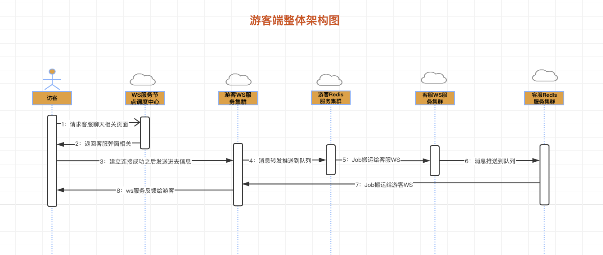

## 设计文档

#### 游客端设计图
* 

#### 聊天
* 动作枚举
    * 游客进入页面连接服务：guest_in
    * 聊天窗口打开的时候：guest_connect
    * 聊天：chat
    * 游客关闭聊天：guest_close
    * 客服关闭聊天：kf_close_guest
    * 分配客服：assign_kf
    * 换客服：change_kf
    * 表单：form
    * 系统消息：system

* 数据格式（JSON:[ "cmd" => 动作,"data" => 参数array  ] ）
    * 游客进入页面连接服务

        ```
        请求数据：
            cmd : guest_in
            data => [
                "rf" => "来源referer",
                "page" => "当前页面",
                "sn" => "商户标示",
                "ua" => "浏览器UserAgent",
                "sn_g" => "游客唯一编码，从浏览器中获取"
            ]
        返回参数：
            cmd : resp_in
            data => [
                "num" => 1
            ]
        ```

    * 聊天窗口打开的时候（可能会进入等待队列）

        ```
        请求数据：
            cmd : guest_connect
            data => [
                "sn" => "商户标示",
                "sn_g" => "游客唯一编码，从浏览器中获取"
            ]

        返回参数：
            cmd : assign_kf
            data => [
                "sn_k" => "客服唯一编码，通过这个编码可以知道是哪个客服",
                "kf_name" => "客服名称"，
                "kf_avatar" => "客服头像"
            ]
        ```

    * 聊天

        ```
        请求数据：
            cmd : chat
            data => [
                "sn" => "商户标示",
                "sn_g" => "游客唯一编码，从浏览器中获取",
                "sn_k" => "客服唯一编码，通过这个编码可以知道是哪个客服",
                "kf_name" => "客服名称"，
                "kf_avatar" => "客服头像",
                "content" => "输入的聊天内容"
            ]

        返回参数：
            cmd : resp_chat
            data => [
                "conent" => "回复的聊天内容",
            ]
        ```
    * 换客服（更换记录的客服信息）
        ```
        接受消息：
            cmd : change_kf
            data => [
                "sn_k" => "客服唯一编码，通过这个编码可以知道是哪个客服",
                "kf_name" =>  "客服名称"，
                "kf_avatar" => "客服头像"
            ]
        ```
    * 系统消息（欢迎语等）
        ```
        接受消息：
            cmd : system
            data => [
                "conent" => "系统消息内容",
            ]
        ```
    * 表单（如果没有一个在线客服）
        ```
        请求数据：
            cmd : guest_connect
            data => [
                "sn" => "商户标示",
                "sn_g" => "游客唯一编码，从浏览器中获取"
            ]

        返回参数：
            cmd : form
            data => [
                "content" => "一段表单备注语"
            ]
        ```
    * 客服关闭聊天
        ```
        接受消息：
            cmd : kf_close_guest
            data => [
                "content" => "客服主动关闭连接，看是否需要弹出评价功能",
            ]
        ```

#### 表设计
* 商户表：merchant
* 商户配置表：merchant_config
* 商户员工表：merchant_staff
* 会员表：member
* 聊天消息表（需要分表，跟着商户ID分，分100张）：message
* 历史追踪表：guest_trace ，主要记录guest_in动作的参数