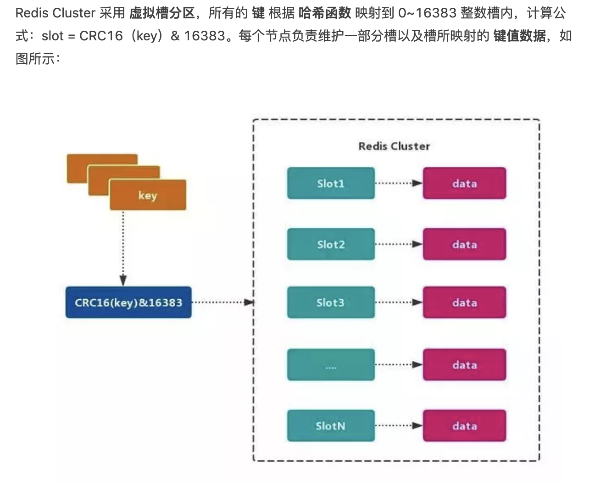

## 客服系统V1版本架构图

#### 架构图
* 
* 
* 
#### 系统要求
* 多端
    * 商户端
    * 客服端（要求将web打包成exe）
    * 游客端
    * 管理后台端
        * redis服务监控
        * WS服务调度节点中心 管理
* 高度可扩展
    * 将游客端 和 客服端的 WS服务分割开，这样就可以随意扩展游客端 WS服务集群增加链接数量
    * 游客端 和 客户端的 消息通过 redis 队列 中转。其中建议将 分两组 redis 集群服务。
    * 所有WS链接信息 通过 WS服务调度节点中心 分配。
    * 所有聊天内容全部异步存储（Redis集群）让聊天反应更快
* WS服务调度节点中心
    * 所有的WS服务 节点 都要注册 进来。将游客WS服务 和 客服WS服务分开

* 分控模块（预留好位置，第一期先不要做）
    * 游客端  未来 通过大数据 行为轨迹分析 将恶意的人 踢出
* Job 通过 Text 协议将内容 推送 给 WS服务，然后进行WS回复
* Redis 服务组（redis是系统的核心中转站，需要做好redis监控系统。阿里云有集群服务 比较贵）
    * 游客Redis集群
    * 客服Redis集群
    * 聊天内容存储redis集群

#### 参考文章
* [深入剖析Redis - Redis集群模式搭建与原理详解](https://www.jianshu.com/p/84dbb25cc8dc)

